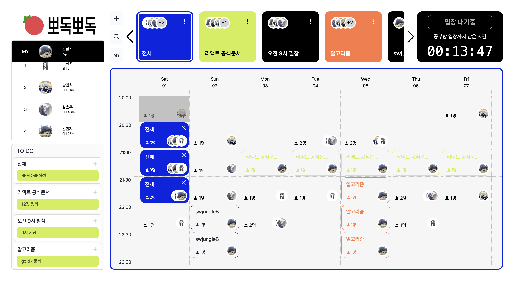
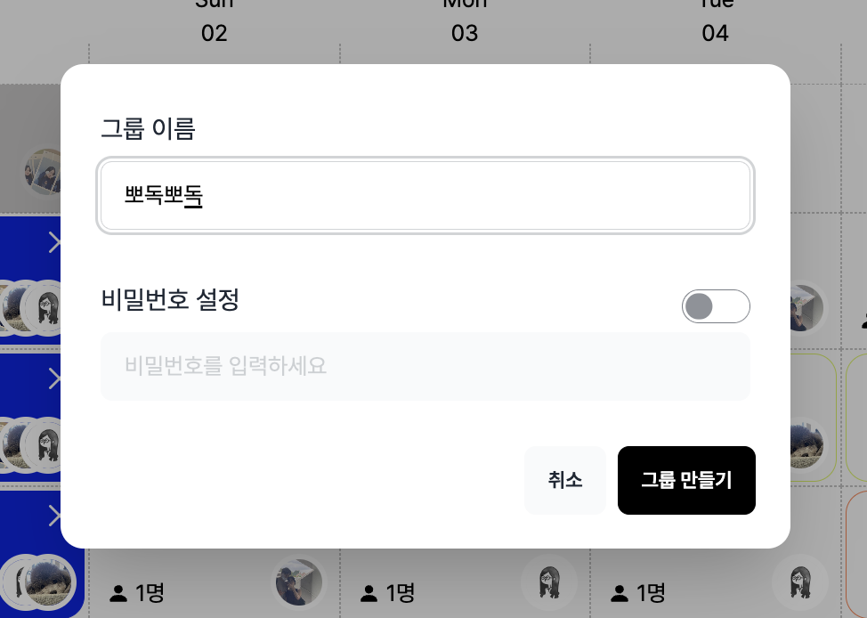
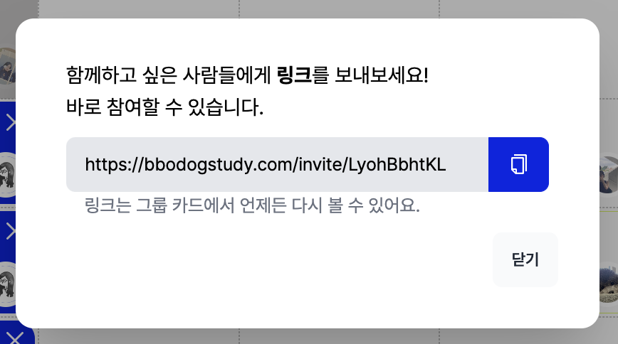

# 뽀독뽀독 - 온라인 독서실

SW사관학교 JUNGLE 6기

개발 기간 : 2023.06.07 - 2023.06.30

# 배포주소

## https://bbodogstudy.com

# 프로젝트 소개

뽀독뽀독은 뽀모도로 타이머 기능을 가진 온라인 독서실 플랫폼으로, 학습을 효율적으로 이끌어주는 기능을 제공합니다. 학생들은 공유된 공간에서 다른 사람들과 함께 비대면으로 학습할 수 있습니다.

# 기술스택

|                                                                                                                                                                                                             collaboration                                                                                                                                                                                                             |                                                                                                                                                                                                                                                                                                                                                                                                                                             Front End                                                                                                                                                                                                                                                                                                                                                                                                                                             |
| :-----------------------------------------------------------------------------------------------------------------------------------------------------------------------------------------------------------------------------------------------------------------------------------------------------------------------------------------------------------------------------------------------------------------------------------: | :-----------------------------------------------------------------------------------------------------------------------------------------------------------------------------------------------------------------------------------------------------------------------------------------------------------------------------------------------------------------------------------------------------------------------------------------------------------------------------------------------------------------------------------------------------------------------------------------------------------------------------------------------------------------------------------------------------------------------------------------------------------------------------------------------------------------------------------------------------------------------------------------------: |
|     |         |

|

# 화면 구성

랭킹, Todo, 스터디 룸 예약 현황 table, 참여 그룹 정보, 입장 시간 타이머 기능이 존재

그룹 생성 and 초대 모달
| | |
|---|---|
|||

# 주요기능

1. 다른 사용자들의 예약 결과를 바로 확인할 수 있는 실시간 예약 타임테이블
2. 화상채팅, 채팅, 타이머 기능이 있는 스터디 룸
3. 그룹 개설 기능
4. WEB PUSH를 통한 스터디룸 입장 알림 기능
5. TODO
6. 개인의 학습량을 확인할 수 있는 MYPAGE

# 팀 소개

|                          |                           |                            |                            |
| :----------------------: | :-----------------------: | :------------------------: | :------------------------: |
|  |  |  |  |
|          김은우          |          김현지           |           방민석           |           이서현           |
